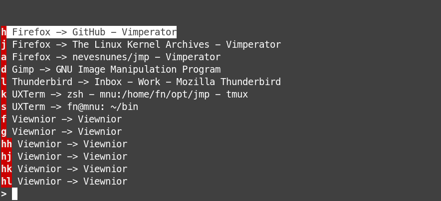

# jmp



**jmp** is a TUI window switcher, using a hint based system similar to browser extensions such as Vimperator or Vimium. This means you rarely need to press more than 1 or 2 keys to switch to a window!

## Use Cases

* Just like you can launch applications from your terminal (either directly or through `xdg-open`), you may be inside a terminal when you want to switch to another window
* In case you don't have a running terminal, you can bind a keyboard shortcut to launch a terminal, passing `jmp` as the command to run. For example, with `uxterm` (assuming `jmp` is in your `$PATH`):

```
uxterm -e jmp
```

## Dependencies

* ncursesw (new curses with wide-character support)
* wmctrl

## Compiling & Running

```
make
./jmp
```

## Keyboard Shortcuts

| Shortcut                       | Description           |
| ------------------------------ | --------------------- |
| Escape, Ctrl+C, Ctrl+D, Ctrl+G | Close                 |
| Arrow Down, Page Down, Ctrl+N  | Scroll down           |
| Arrow Up, Page Up, Ctrl+P      | Scroll up             |
| Enter, Ctrl+J, Ctrl+M          | Accept selection      |
| BackSpace, Ctrl+H              | Delete last character |
| Ctrl+L                         | Delete input          |

## Configuration

Not much. See **options.h**.

## License

MIT
